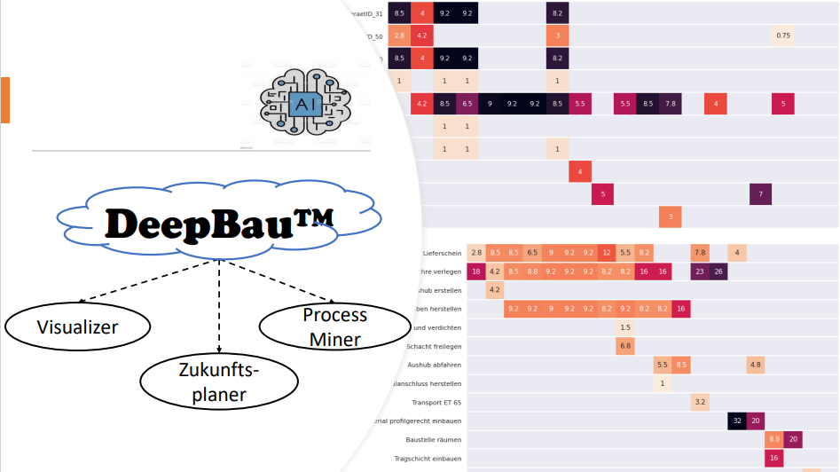
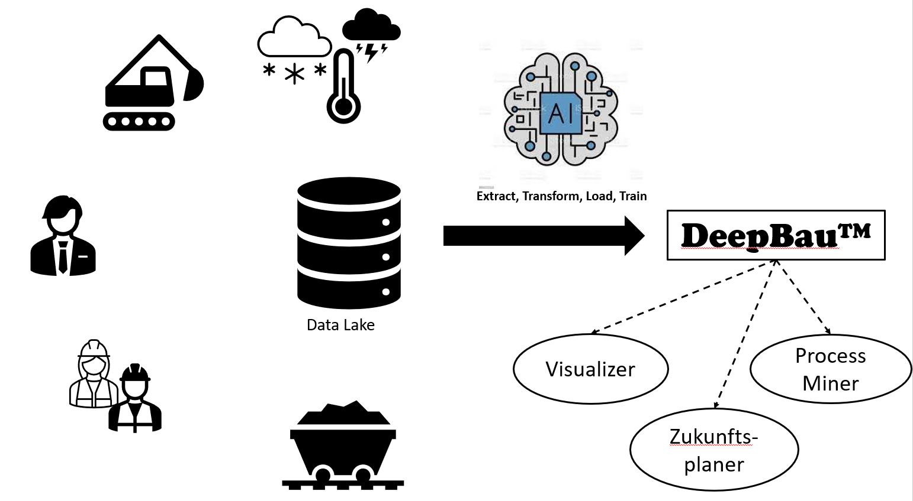

# DeepBau

Hackathon for construction sites
48hours, 2 persons

Video pitch and full description available on [Devpost](https://devpost.com/software/sdacathon_?ref_content=user-portfolio&ref_feature=in_progress).

## Concept

## Inspiration

Digitalization is not bypassing the construction industry. Everywhere you hear buzzwords like BIM or lean construction. These methods are used to optimize the individual process chains of construction projects and to identify interfaces as early as the palletization phase. But where exactly do problems arise? How can we avoid wasting resources such as time, material and manpower? This is exactly where we want to start with DeepBau. There is a lot of data, but it is stored unused on servers of individual companies. We evaluate this data and try to develop optimized construction process plans with the help of AI. Our process mining tool DeepBau brings structure and clarity to confusing construction projects. Lean construction is made possible through smart visualizations of process chains and AI algorithms are used to detect future events and problems at an early stage.

## What it does

User-defined visualization for process chains in ongoing construction projects
Visualizations of the latest progress on the construction site
Visualization of the temporal course of resources and processes: Work equipment, material, people, weather
AI algorithm to predict future project steps

## How we built it

- Django webapp
- Bootstrap v5 frontend
- Python backend
- LSTM encoder-decoder architecture

## Challenges we ran into

Domain knowledge of workers on a site was missing and not to be made up by short calls in times needed for coding.
Presentation of results from trained process mining algorithms lacking due to non-existent domain knowledge
Familiarization and understanding of the data lake took longer than expected, as specific features and missing data in tables only became apparent during the course of the project
Accomplishments that we're proud of
End to end data processing, application and trained machine learning algorithm in 2 days with 2 people :-)
What we learned
Domain knowledge should have been more involved, best with civil engineer in the team
Time pressure in data preprocessing and loading in data generator for AI model we would pay more attention/time to avoid errors

## What's next for DeepBau

Direct connection of the api of the datalake to our webapp (currently all existing data is downloaded and loaded from memory)
Improving the training of the AI algorithms with more computing power.

